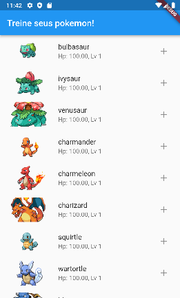

# Exemplos de testes de unidade com Flutter
Fiz aqui um app simples como forma de compartilhar uma maneira simples de aprender testes de unidade.

Nele, busco uma lista de pokemon na [PokéApi](https://pokeapi.co/) e os mostro em um widget do tipo [ListView](https://api.flutter.dev/flutter/widgets/ListView-class.html), conforme abaixo:



## Sobre os testes
### Pokemon.dart
O [modelo de pokémon](./lib/models/pokemon.dart) possui 2 métodos: levelUp, onde aumento o HP do pokemon e o nível dele, e um método fábrica fromJson, conforme abaixo:
* levelUp:
```
void levelUp() {
  level++;
  hp *= 1.05;
}
```

* fromJson:
```
factory Pokemon.fromJson(Map<String, dynamic> json) {
  return Pokemon(
    name: json['species']['name'],
    imageUrl: json['sprites']['front_default'],
  );
}
```

Por mais que o método levelUp faça 2 coisas, decidi mantê-lo assim para a simplicidade de projeto. Pois bem, para esse método, é necessário verificar 2 pontos:
* ao ser chamado, o nível do pokémon aumentará ?
* ao ser chamado, o hp do pokémon aumentará 5% ?

Para isso, escrevi os seguintes testes:
```
test('When a pokemon levels up, then it\'s level increases', () {
  // Arrange
  final pokemon = Pokemon(name: 'Bulbasaur');
  final initialLevel = pokemon.level;
  final expectedLevel = initialLevel + 1;
  // Act
  pokemon.levelUp();

  // Assert
  expect(pokemon.level, expectedLevel);
});
```

E 

```
test('When a pokemon levels up, then it\'s HP increases 5%', () {
  // Arrange
  final pokemon = Pokemon(name: 'Bulbasaur');
  var expectedHp = pokemon.hp * 1.05;
  
  // Act
  pokemon.levelUp();

  // Assert
  expect(pokemon.hp, expectedHp);
});
```

Gosto de seguir o padrão **AAA** pára meus testes:
* Arrange: você cria as variáveis e as configurações daquele teste em específico;
* Act: você realiza a chamada do método;
* Assert: você verifica se o resultado obtido é o resultado esperado. 

Inclusive, mantenho os comentários para facilitar na visualização dessas fases.

Explicando os testes com base nas fases:
- No primeiro, crio um pokémon e defino qual o nível esperado(Arrange), então chamo o método de levelUp (Act) e por fim garanto que o level do pokémon é igual a level inicial + 1;
- No segundo, crio um pokémon e defino qual o hp esperado (Arrange), então chamo o método de levelUp (Act) e por fim garanto que o HP do pokémon é igual a hp + 5%.

Por que isso é importante?

Imagine que você precisasse testar isso manualmente. Quanto tempo levaria do momento no qual você escolhe um inicial até o momento que chegasse no Level 30 apenas para verificar que o HP do seu pokémon é 411.61? A execução dos testes na minha máquina, que nem é muito potente, levou apenas 1 segundo!

## PokemonApiClient.dart
[Essa](./lib/data/pokemon_api_client.dart) é a classe responsável por obter os dados da PokeApi. Ela possui apenas 1 método mas 2 possíveis saídas: 1 para o caminho feliz, onde tudo funciona e a api retorna o resultado esperado, e 1 para o caminho triste onde algo acontece e a api não retorna o valor esperado:
```
Future<List<Pokemon>> getPokemon() async {
  List<Pokemon> pokemons = [];
  for (int i = 1; i <= 10; i++) {
    var response = await client.get(Uri.parse('$url/$i'));
    if (response.statusCode == 200) {
      var json = jsonDecode(response.body);
      pokemons.add(Pokemon.fromJson(json));
    }
  }
  return pokemons;
}
```
Infelizmente precisei usar um for para chamar o endpoint específico de cada pokémon pois a versão da requisição com paginação não retorna os dados de sprite, o que deixaria a interface ainda mais limitada do que já é.

Testes de unidade precisam testar apenas a unidade, e na maioria das vezes, a unidade é um método. São o tipo mais simples de testes e devem ser executados de forma independente (sem dependências a bancos de dado, APIs etc) e rápida. Por essas características, eles costumam ser os testes em maior número em uma aplicação.


Então como testar chamadas a alguma API ou banco de dados ? Usando mocks -- objetos que simulam o comportamento de outro.

Para os testes dessa classe, utilizei a lib mockito, [conforme exemplo da documentação do Flutter](https://docs.flutter.dev/cookbook/testing/unit/mocking), mas você pode utilizar qualquer uma que faça algo parecido.

```
@GenerateMocks([http.Client])
void main() {
  group('getPokemon method', () {
    test(
        'When response\'s status code is not 200, getPokemon returns an empty list',
        () async {
      // Arrange
      final client = MockClient((request) async {
        return Response('', 404);
      });
      final pokemonClient = PokemonApiClient(client: client);
      final expectedResult = [];

      // Act
      final result = await pokemonClient.getPokemon();

      // Assert
      expect(result, expectedResult);
    });

    test(
        'When response\'s status code is 200, getPokemon returns a pokemon list',
        () async {
      // Arrange
      final client = MockClient((request) async {
        return Response(
            '{"species": {"name": "bulbasaur"}, "sprites": {"front_default": ""}}',
            200);
      });
      final pokemonClient = PokemonApiClient(client: client);

      // Act
      final result = await pokemonClient.getPokemon();

      // Assert
      expect(result.length, 10);
    });
  });
}
```
Aqui temos 3 novos conceitos importantes, que são:
* @GenerateMocks([http.Client]): aqui utilizo a lib mockito e peço para que ela crie uma nova instância de mock de http.Client para cada teste. Para que isso funcione, precisei instalar a lib build_runner e utilizar o comando 
```
$ flutter pub run build_runner build
```
* group: uma forma de agrupar testes relacionados a uma mesma classe ou a um mesmo método;
* final client = MockClient((request) async {return Response('', 404);}); : é aqui que crio o client mockado. Ele será passado para a classe **PokemonApiClient** através do construtor. Essa é uma forma de externalizar as dependências de uma classe e fazer com que ela seja menos acoplada -- nesse caso, por exemplo, qualquer client poderia ser passado para ela. O importante ao mockar um objeto é definir a resposta que ele terá para um método qualquer dele. Nesse caso, falei que preciso que ele retorne as requisições com uma resposta vazia e status 404. 

Com esses conceitos explicados, falarei sobre os testes em si:
* No primeiro, crio o mock do client, a variável do resultado esperado: uma lista vazia e uma instância de PokemonApiClient(Arrange), depois chamo o método getPokemon (Act) e por fim verifico se o resultado obtido é o mesmo que o esperado (Assert).
* No segundo, faço a mesma coisa mas dessa vez configuro o client para retornar o json de um pokemon. Como dentro do método tenho um for que roda 10 vezes, na parte Assert do método, verifico se a lista possui 10 pokemons e que o nome do pokemon é o mesmo obtido na resposta.

Por que isso é importante? 

É bem legal pensar até que ponto é necessário testar uma classe ou um método. Se fosse apenas uma chamada a uma api, sem qualquer outro comportamento, será que faria sentido fazer testes de unidade, uma vez que a chamada seria mockada ? Enfim, como há comportamento nesse método, é importante verificar não apenas se ele retorna o esperado, mas se ele retorna o esperado em ambos os caminhos: resposta 200 / qualquer outra resposta.

